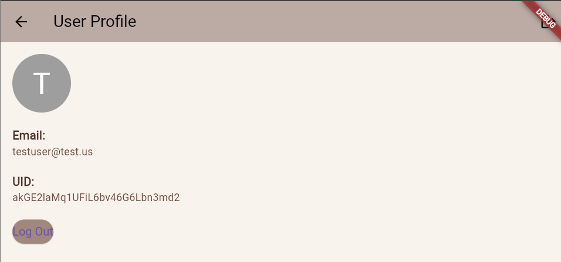

# Movie Browser

Movie Browser is a Flutter-based application designed to help users explore and discover movies. The app allows users to view movie details, including title, description, and poster, with a simple, user-friendly interface. Users can also add movies to their favorites, register an account, and log in to previously registered accounts.

## Features

- Browse movies  

- Search for movies  

- Sort movies by specified filters  

- Add movies to favorites  


- Create a user account  

- Log in to an existing account  

- Manage user account  


- Switch to dark mode  


- Responsive design for mobile and web platforms

## Tech Stack

- **Framework**: Flutter
- **Programming Language**: Dart
- **Platform**: Mobile (Android, iOS) and Web
- **State Management**: Provider (or any other preferred solution)
- **Database**: Firebase
- **Authentication**: Firebase Authentication
- **Theme Management**: Custom theme management for light and dark mode
- **Routing**: Flutter's built-in navigation system
- **Additional Libraries**: Firebase Core, Firebase Options, HTTP, intl, cloud_firestore

## Setup

1. Ensure that you have the latest version of Flutter installed. You can check if Flutter is properly installed by running:
 ```bash
 flutter doctor
 ```

2. Clone this repository to your local machine:
 ```bash
 git clone https://github.com/Radione530/ex_2.git
 cd movie_browser
 ```

3. Install Dependencies:
 ```bash
 flutter pub get
 ```

4. Run the App:
 - Choose a device or emulator
 - To run the app on Android device:
 ```bash
 flutter run
 ```
 - To run the app on a browser:
 ```bash
 flutter run -d chrome
 ```
 - For running on Windows/macOS/Linux:
 ```bash
 flutter run -d windows
 ```

5. Test the App:
 Test the login, user registration, account management, and movie viewing features. Ensure the app works properly on various devices (mobile, desktop) and browsers.

6. Additional Notes:
 The app supports both dark and light modes, depending on the system settings. If you encounter issues when running the app, check the system requirements and dependencies.
